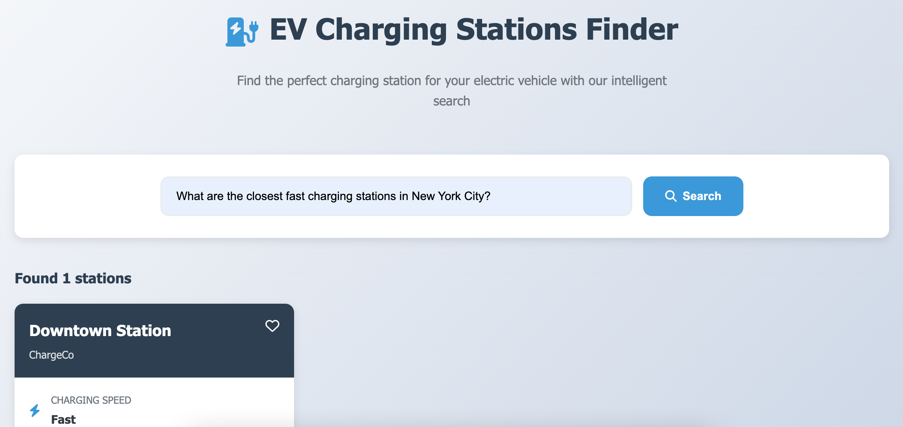

# ⚡ EV Charging Station Finder (AI-Powered) (Done by Nasrin Mazaheri)

An AI-driven assistant that helps users find the **best EV charging stations** based on natural language queries — including location, charging speed, accessibility, and user reviews.

Built with **FastAPI**, **OpenAI/OpenRouter LLMs**, **OpenCage Geolocation**, and **SQLite**.  
Deployed on **Render** with a lightweight HTML frontend.

---

## 🚀 Live Demo

🔗 **Try it here:** [Live Demo](https://ev-charging-stations-d1vw.onrender.com)



You can ask questions like:
> “I’m in Tokyo, which EV charging stations have the best reviews?”  
> “Show me fast public chargers near San Francisco.”  
> “Find supercharger stations with Type 2 connectors in Berlin.”

---

## 🧠 System Architecture

The following diagram shows how the system components interact:

🔗 **Architecture Diagram:** [View on Draw.io](https://drive.google.com/file/d/13H_nKS8P7x2m_FGJ5yOPGjY7-nvxjfzf/view?usp=drive_link)

## 🎥 Video about the project

[View on Loom](https://www.loom.com/share/df18335d26f3443d98da28ed5479a212?sid=317c8151-723c-4d90-b29b-53d14437de01)

---
### Overview

```plaintext
User (Browser)
   │
   ▼
Frontend (index.html + JS)
   │  sends question via POST /process
   ▼
FastAPI Backend (api.py)
   │
   ├─> OpenRouter API (LLM): parses filters from natural language
   ├─> OpenCage API: geocodes city names to lat/lon
   └─> SQLite Database: retrieves matching charging stations
   │
   ▼
Response returned to browser (displayed beautifully)
```

---

## 🧩 Features

✅ **Natural Language Querying**
- Ask in plain English — no need for filters or menus.  
- The system extracts: city, latitude, longitude, charging type, speed, and accessibility.

✅ **AI Integration**
- Uses **LLM (OpenRouter/OpenAI API)** to interpret user intent and generate structured filters.

✅ **Geolocation Support**
- Uses **OpenCageData API** to convert city names into coordinates.

✅ **Sentiment Analysis**
- Considers `average_sentiment` and `num_reviews` to rank stations by user satisfaction.

✅ **Interactive UI**
- Simple HTML + JavaScript frontend (served directly by FastAPI).
- Beautifully formatted station results with key details.

✅ **Deployment-Ready**
- Hosted on **Render**.
- Fully containerized and reproducible.

---

## 🏗️ Project Structure

```
.
├── src/
│   └── ev_charging_stations/
│       ├── api.py                 # FastAPI app (serves HTML + API)
│       ├── pipelines/
│       │   └── query_pipeline.py  # Main logic for parsing and querying
│       ├── models/                # Pydantic models for structured data
│       └── database.py            # SQLite DB interaction
│
├── tests/
│   ├── test_api.py                # Tests for API endpoints
│   └── test_pipeline.py           # Tests for query pipeline
│
├── index.html                     # Frontend UI
├── requirements.txt               # Dependencies for Render deployment
├── README.md                      # Project documentation (this file)
└── .env                           # API keys and config (not committed)
```

---

## ⚙️ Installation (Local Development)

### 1️⃣ Clone the repository
```bash
git clone https://github.com/DataChefHQ/THA_Nasrin-Mazaheri-27e16279
cd chalengechallenges/ev_charging_stations
```

### 2️⃣ Install dependencies
```bash
pdm install
```

### 3️⃣ Set up environment variables
Create a `.env` file in the root folder:

```
OPENROUTER_API_KEY=<your_api_key_here>
OPENCAGE_API_KEY=<your_api_key_here>
```

### 4️⃣ Run the app
```bash
pdm run uvicorn src.ev_charging_stations.api:app --reload
```

Then open your browser at:
👉 [http://127.0.0.1:8000](http://127.0.0.1:8000)

---

## 🧪 Running Tests

You can run all tests with:
```bash
pdm run pytest tests
```

Example test file included:
- ✅ `test_api.py` — verifies endpoints
- ✅ `test_pipeline.py` — verifies LLM + DB pipeline logic

---

## ☁️ Deployment on Render

1. Push your code to GitHub.
2. Create a new **Render Web Service**.
3. Configure:
   - **Root directory** → `.`
   - **Build command** → `pip install -r requirements.txt`
   - **Start command** → `uvicorn src.ev_charging_stations.api:app --host 0.0.0.0 --port 10000`
4. Add environment variables (`OPENROUTER_API_KEY`, `OPENCAGE_API_KEY`).
5. Deploy 🚀

---

## 📦 Requirements

| Package | Version | Description |
|----------|----------|-------------|
| fastapi | ≥ 0.119.0 | API framework |
| uvicorn | ≥ 0.37.0 | ASGI server |
| pydantic-settings | ≥ 2.11.0 | Config management |
| pandas | ≥ 2.3.3 | Data handling |
| textblob | ≥ 0.19.0 | Sentiment analysis |
| python-dotenv | ≥ 1.1.1 | Env vars |
| openai | ≥ 2.5.0 | OpenRouter client |
| requests | ≥ 2.32.5 | HTTP requests |
| pytest | ≥ 8.4.2 | Testing |

---

## 🧑‍💻 Authors

- **Nasrin Mazaheri** – [Github](https://github.com/n-mazaheri)
- Developed as part of the *EV Charging Station Finder* AI project.

---

## 📎 Links

- 🌐 **Live Demo:** [https://ev-charging-stations-d1vw.onrender.com](https://ev-charging-stations-d1vw.onrender.com)  
- 📊 **System Design Diagram:** [https://drive.google.com/file/d/13H_nKS8P7x2m_FGJ5yOPGjY7-nvxjfzf/view?usp=drive_link](https://drive.google.com/file/d/13H_nKS8P7x2m_FGJ5yOPGjY7-nvxjfzf/view?usp=drive_link)  
- 🧾 **Source Code:** [https://github.com/DataChefHQ/THA_Nasrin-Mazaheri-27e16279/tree/main/challenges/ev_charging_stations](https://github.com/DataChefHQ/THA_Nasrin-Mazaheri-27e16279/tree/main/challenges/ev_charging_stations)

---

## 🛡️ License

This project is licensed under the MIT License — feel free to use and modify.

---

**Enjoy exploring smarter EV charging! ⚡🚘**
